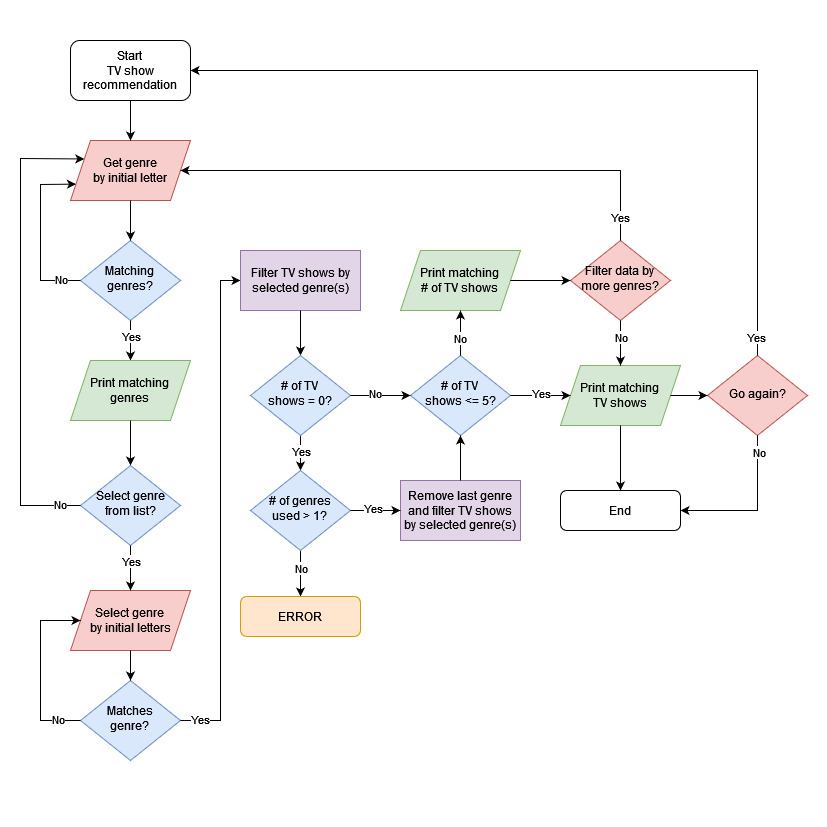

# Computer Science Projects - Portfolio Project: Recommendation Software

This portfolio project was created as part of [Codecademy's](https://www.codecademy.com) Computer Science Career Path course.

## Table of contents

- [Project Overview](#project-overview)
  - [Project objectives](#project-objectives)
- [Recommendation Software](#recommendation-software)
  - [Screenshots](#screenshots)
- [Process](#process)
  - [Flow chart](#flow-chart)
  - [Coding decisions](#coding-decisions)
  - [What I learned](#what-i-learned)
  - [Potential improvements to program](#potential-improvements-to-program)
  - [Useful resources](#useful-resources)
- [Author](#author)

## Project Overview

"In this portfolio project, you will research, brainstorm, and build a basic recommendation program for a topic of your choice. By entering letters or words into the terminal, the program will suggest a specific category for the user to explore. If the user is interested in the category, the program will provide a variety of related recommendations to the user. After you finish building the program, you will create a blog post to share the program on a publication of your choice!" - [Codecademy](https://www.codecademy.com)

### Project objectives

- Store data in a data structure.
- Use an algorithm to sort or search for data within a data structure.
- Use Git version control.
- Use the command line and file navigation.
- Write a technical blog post on the project.

## Recommendation Software

For this particular project I decided to create recommendation software for UK TV shows.

- Solution URL: [TV Show Recommendations](./tv_show_recommendations.py)

### Screenshots

#### Instructions:

 TODO

#### Number of recommendations for selected genre:

 TODO

#### Filtered recommendations for multiple genres:

 TODO

## Process

- Think of an idea for the type of recommendation software that I want to build - what topic will it be focused on.
- Project brainstorming on how the recommendation software will work:

  - Recommendation software to be based on recommending UK TV shows by genres.
  - Import [dictionary of data](./tv_shows.py) where keys are TV shows and values are the TV show's genre(s).
  - Import Node and Stack classes as stack to be used to contain the selected genres that will filter the TV shows.
  - Display instructions of how to use the recommendation software.
  - START:
    - Get initial letter for genre type from user and check if any genres match initial letter:
      - If no, ask user for a different initial letter.
      - If yes, display list of matching genre names.
    - Ask user whether wish to choose genre from matching genre names:
      - If no, ask user for a different initial letter.
      - If yes, is there is only one matching genre?
        - If yes, add genre to stack to filter TV shows by that genre.
        - If no, get initial letters (minimum 2) from user and check if that matches any from the genre list already generated.
          - If no, ask user to enter letters again to match genre from genre list.
          - If yes, add genre to stack to filter TV shows by that genre.
    - Is number of TV shows that match the chosen genre = 0?
      - If yes, is number of genres used to filter > 1?
        - If no, then should state error as should have shows to show for a single genre.
        - If yes, remove last genre from stack and refilter by genres left in stack and continue with the following if no below.
      - If no, is number of TV shows <= 5?
        - If yes, display TV show recommendations based off selected genres and ask user whether wish to choose another genre to filter the recommendations further.
          - If yes, go back to get another genre.
          - If no, display number of TV show recommendations that match the selected genres.
        - If no, display number of TV show recommendations that match the selected genres.
    - Ask user whether wish to get another TV show recommendation?
      - If yes, RESTART.
      - If no, END.

- Set up a GitHub repository.
- Set up Git version control.
- Use ChatGPT to help create data for UK TV shows and their genres.
- Write recommendation software program.
- Refactor program.
- Create blog post about project. (This README file is my post about the project I have created.)

### Flow chart

### Coding decisions

There are a number of decisions I made as to how to approach and code this recommendation software. So below is an explanation as to the what and why I wrote the code in the way that I did.

- When creating a flowchart for describing the basic structure of how I wanted the program to work, it became obvious that using a stack to contain the selected genres to use to filter the TV shows would be needed.
- TODO
- Error checking is down for:
  - User input when getting and selecting genres:
    - Input is not empty, or only whitespace
    - Input is letters only.
- TODO

### What I learned

- TODO

### Potential improvements to program

- TODO

### Useful resources

- [ChatGPT](https://chatgpt.com/)

## Author

- V. Tickner
